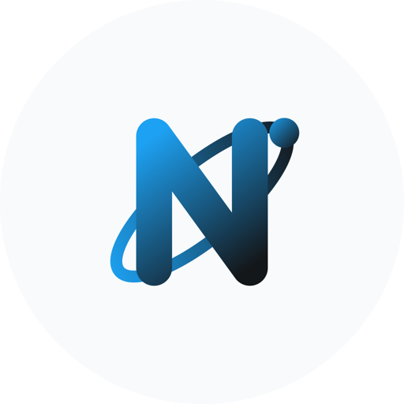
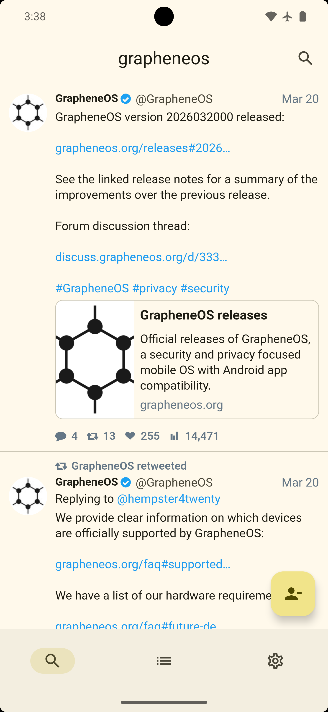
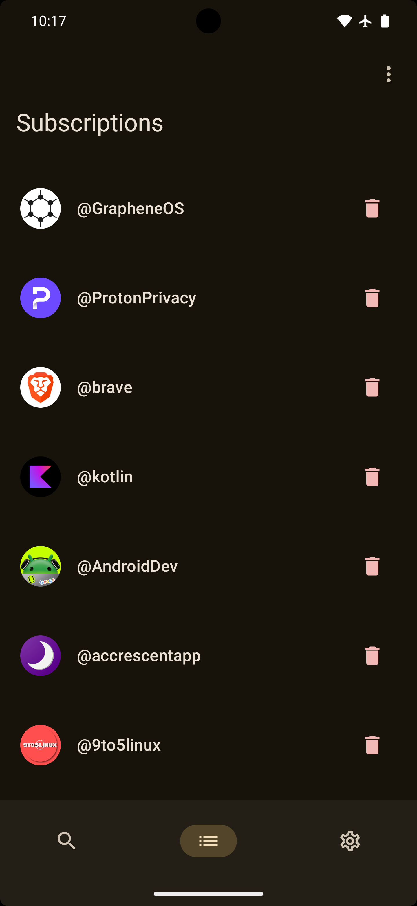
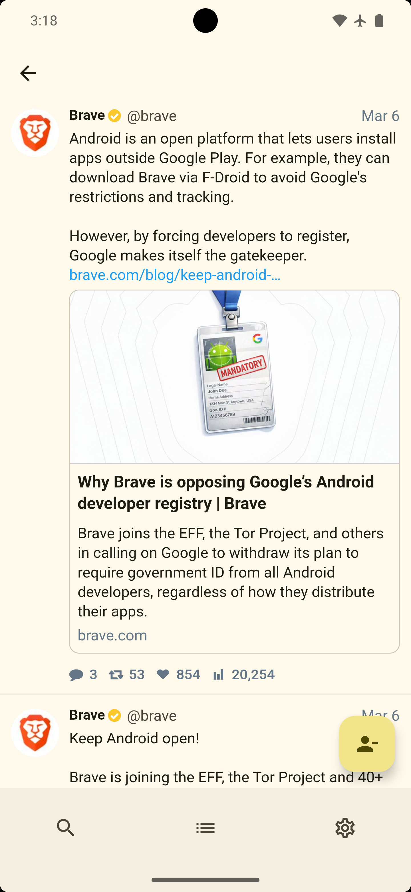
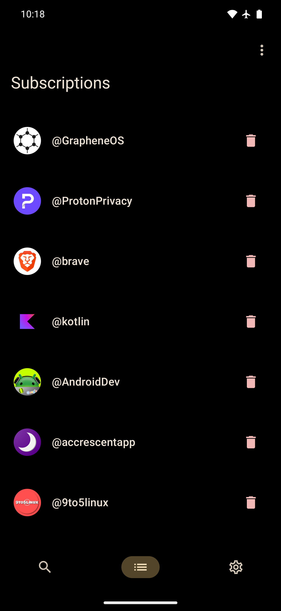
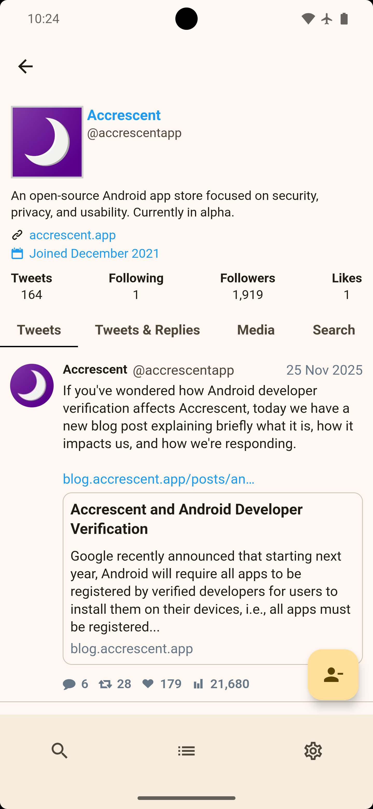
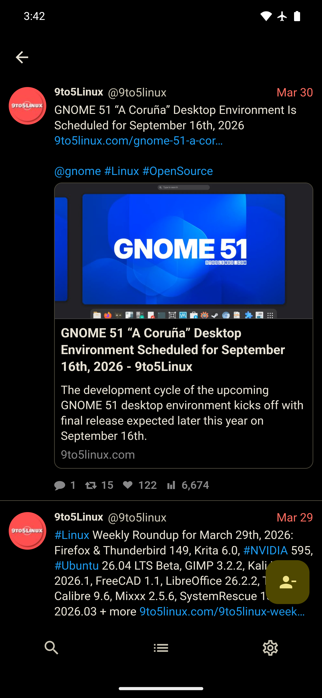
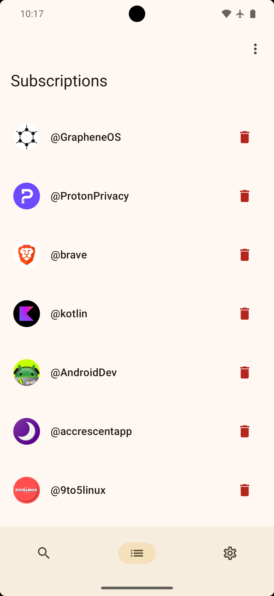
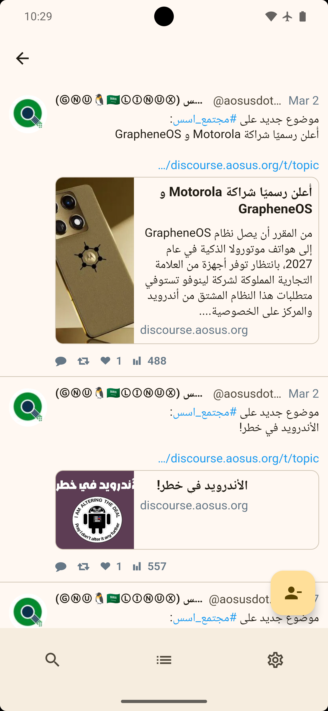

  

<h1 align="left">Nitterium</h1>

  <strong>A privacy-focused Android app and wrapper for Nitter, allowing you to browse Twitter/X content without an account and subscribe to your favorite user profiles.</strong>

---

**Nitterium** is a modern, native Android app that provides a clean, privacy-respecting way to consume Twitter/X content. By leveraging Nitter instances, it avoids tracking and requires no user account, all wrapped in a beautiful Jetpack Compose interface.

### 🤔 Why this?
While browsing Nitter on Android, I needed a way to subscribe to accounts I was interested in following, along with some customization options. That led to the creation of this app!

> [!Important]
> This app depends entirely on Nitter persistence and the operational state of public Nitter instances. It's important to check the source and health of the instance you are using.

---

## ✨ FEATURES

* 🔒 **Privacy First**: No ads, no tracking, and no Twitter/X account required.
* 🕸️ **Nitter Integration**: Browse seamlessly using your preferred Nitter instance via a custom WebView wrapper.
* 📌 **Subscriptions**: Save and manage your favorite accounts locally on your device. Each account can be rearranged individually by dragging and dropping to suit your preferences!
* 🖼️ **Intuitive Image Viewer**: Easily exit the image viewer by swiping up or down, and download images directly to your device.
* 🔄 **Pull-to-Refresh**: Swipe down to reload content seamlessly.
* 🎨 **Dynamic Theming**: Beautiful Material 3 design that automatically adapts to your system theme and wallpaper (Android 12+).
* 🚀 **Modern UI**: A fast, responsive user interface built entirely with Kotlin and Jetpack Compose.
* 🔗 **Deep Linking**: Automatically intercepts Twitter, X, and Nitter links to open them directly in the app.
* 🌍 **RTL Support**: Supports RTL content by default.
* ❤️ **FOSS**: 100% Free and Open-Source Software.

---

## 📥 INSTALLATION

Nitterium can be downloaded from:
- **GitHub Releases**: Get the latest APK directly from the [Releases page](https://github.com/kaleedtc/Nitterium/releases).
- **IzzyOnDroid**: Add the IzzyOnDroid repository to your favorite F-Droid client.
- **Obtainium**: Keep track of direct APK updates seamlessly.

  
  
  

---

## 🔐 PERMISSIONS

Nitterium respects your privacy and requests only the absolute minimum permissions required to function:

**INTERNET**: Required to fetch content and images from Nitter instances over the network.

**ACCESS_NETWORK_STATE**: Used to check if the device is connected to the internet before attempting to load content, providing a better user experience when offline.

---

## 📱 SCREENSHOTS

  
  
  
  

  
  
  
  

---

## 🛠️ BUILT WITH

* **Kotlin**
* **Jetpack Compose**
* **Material 3 Components**
* **Coil 3**
* **Jetpack DataStore & Kotlinx Serialization**

---

## 📜 LICENSE

This project is distributed under the MIT License. See [LICENSE](https://github.com/kaleedtc/Nitterium/blob/main/LICENSE) for more information.

---

## 🤝 ACKNOWLEDGMENTS

A huge thanks to the [Nitter](https://github.com/zedeus/nitter) maintainers and the individuals hosting Nitter instances. Without their hard work and dedication to privacy, this app would not be possible.
